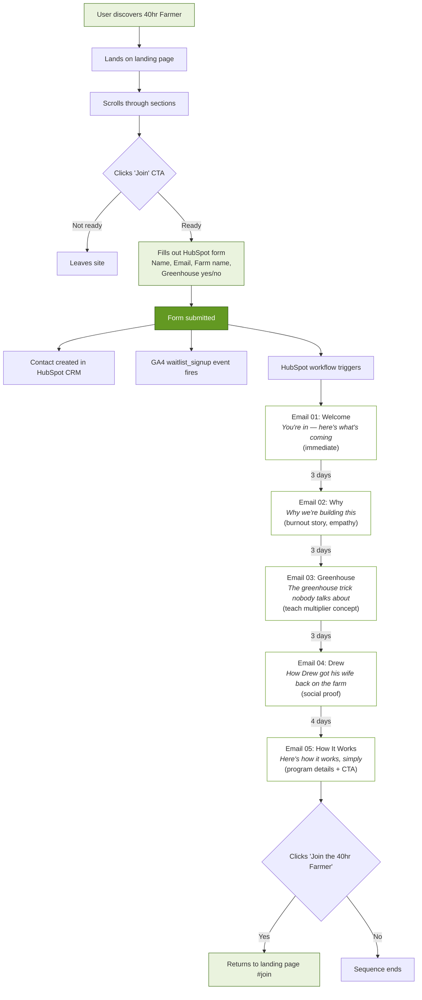

# User Experience Flow



## Timeline

```
Day 0   ──── Form submit + Email 01 (Welcome)
Day 3   ──── Email 02 (Why we're building this)
Day 6   ──── Email 03 (Greenhouse trick)
Day 9   ──── Email 04 (Drew's story)
Day 13  ──── Email 05 (How it works + Join CTA)
```

## Touchpoints summary

| Touchpoint | Channel | Goal |
|---|---|---|
| Landing page | Web | Educate + capture lead |
| Form submit | Web | Convert visitor to contact |
| Email 01 | Email | Welcome, set expectations |
| Email 02 | Email | Build empathy (burnout problem) |
| Email 03 | Email | Teach (greenhouse = leverage) |
| Email 04 | Email | Social proof (Drew's story) |
| Email 05 | Email | CTA to join the program |
