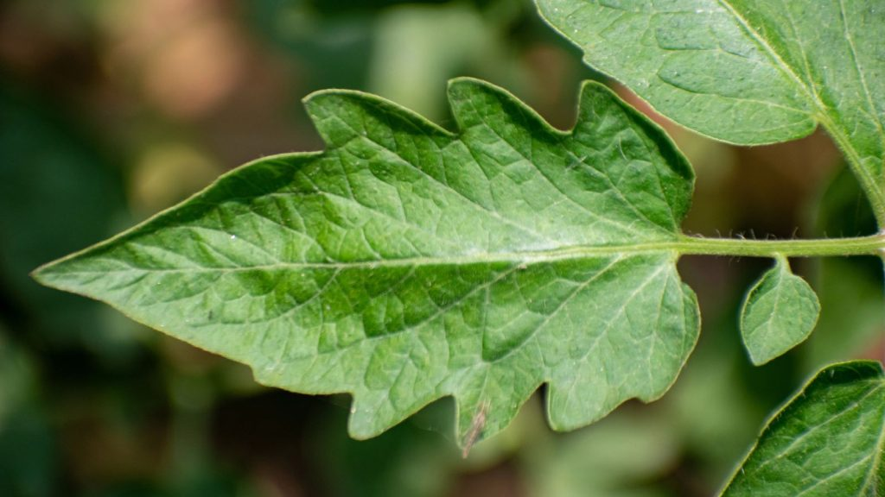

# Midday leaf-cupping scouting

Greenhouse tomatoes. A daily naked-eye check that uses upward
leaf cupping as an early tripwire for water-balance stress.

Cupping is an **early, reversible** signal: caught at first
appearance, the stress is mild and no damage has happened.

## When

- Once a day, at the **midday sun peak** (strongest light, hottest hour).
- Same time each day → comparison only works against a baseline.

## What to look at

- **Upper / younger leaves near the head.** React first, cleanest signal.
- Same plants each day.
- Scan whether it's **house-wide and even** vs **patchy**.

## The signal — confirmed cup

Leaf margins roll **upward** into a trough. Leaf stays **deep
green, turgid, undistorted.**

| See | Read |
|---|---|
| Margins cup up, green, normal shape | Water-balance roll. Proceed. |
| Eases by evening | Confirmed midday demand stress. |
| House-wide, even | Environment (heat / VPD / irrigation / EC). |
| Patchy by bed or input batch | Check that bed's water / feed. |

## Stop — not this protocol

- **Twisted / fern-shaped / distorted tip** → herbicide, mites, or boron.
- **Mottled / yellow / shoestring** → virus.
- **Bronzed brittle cupped tip** → broad / russet mites.

These are not water balance. Different diagnosis.

## On a confirmed cup — check cheapest first

1. **Leaf / head warmth** at midday → hot = stomata already shut.
2. **House temp + vents** → spiking past ~28-30°C? vents opening on time?
3. **Irrigation rhythm** → even and frequent, or dry spell then flood?
4. **Runoff EC** → above target / rising = salts at the root.

## Act on the lever that's off

- **Heat** → shade / vent / cool earlier. Don't over-prune in hot weeks.
- **Irrigation** → smaller, more frequent shots; kill dry spells.
- **EC** → lower feed EC, flush until runoff EC drops.

## Escalate

Cupping itself = mild. The alarm signs are different:

- Wilt that does **not** recover overnight.
- Blossom-end rot.
- Flower / small-fruit abortion.
- Growing-point damage.

## Note — the dawn exception

Hard leaf roll at **dawn**, leaf otherwise fully hydrated,
following a heavy prune or cold night = **carbohydrate
buildup**, not water. Not this protocol. This card is the
midday water-balance check only.
