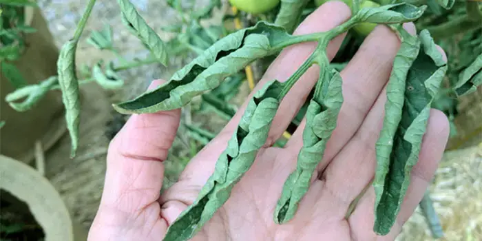

# Midday leaf-cupping scout

Daily naked-eye check for water-balance stress.

Why → [`science/water.md`](../../science/water.md)

## When

- Once a day at the **midday sun peak**. Same time each day.

## Where

- Upper / younger leaves near the head. Same plants.
- Note whether it's house-wide or patchy.

## The signal

Margins roll **upward**. Leaf stays deep green, turgid,
undistorted.

| See | Read |
|---|---|
| Cupped, green, normal shape | water-balance roll |
| Eases by evening | confirmed midday demand stress |
| House-wide, even | environment |
| Patchy by bed or batch | that bed's water or feed |

## Ladder

| Rung | Sign |
|---|---|
| 1 | leaf not cooler than air (touch test) |
| 2a | margins cup upward |
| 2b | leaflets roll into tubes |
| 3 | canopy droops |
| 4 | dead leaf margins |

## Not this protocol

| See | Cause |
|---|---|
| Twisted, fern-shaped, distorted tip | herbicide, mites, boron |
| Mottled, yellow, shoestring | virus |
| Bronzed brittle cupped tip | broad / russet mites |
| Hard roll at **dawn**, leaf hydrated | carbohydrate buildup |

## On a confirmed cup — check cheapest first

1. Leaf / head warmth at midday (touch test).
2. House temp + vent timing. Spiking past 28 to 30 °C?
3. Irrigation rhythm. Even, or dry spell then flood?
4. Runoff EC. Above target or rising?

## Act on the lever that's off

| Off | Do |
|---|---|
| Heat | shade / vent / cool earlier; don't over-prune |
| Irrigation | smaller, more frequent shots; kill dry spells |
| EC | lower feed EC, flush until runoff EC drops |

## Escalate

- Wilt that does not recover overnight.
- Blossom-end rot.
- Flower or small-fruit abortion.
- Growing-point damage.
